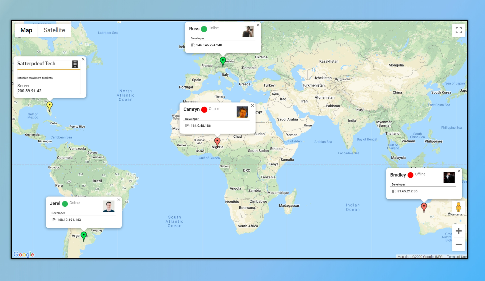

## TypeScript Google Maps Api 101

This project it's a TypeScript 101 fundamentals(Types, Annotations, Interfaces) implementation of a Google Maps API.
The App consists in 2 basic class models(User and Company) which pull random generated data from faker js API, creating map markers to display in the map with their respective info window popup.

## Built With

- HTML5 / CSS
- TypeScript
- Semantic UI
- Faker js
- Google Maps API

## Screenshot



## Setup instructions

Open a terminal window, go to the location you'd like to add the project and then run the commands below.

```console
git clone https://github.com/noomdalv/ts_maps.git
```

```console
cd ts_maps
```

```console
npm install -g parcel bundler
```

```console
npm install
```

```console
parcel index.html
```

#### Special Thanks to [Stephen Grider](https://www.udemy.com/user/sgslo/) for his amazing tutorial.

## Author

👤 **Vladimir Luna**

- Github: [@noomdalv](https://github.com/noomdalv)

## 📝 License

This project is [MIT](lic.url) licensed.
